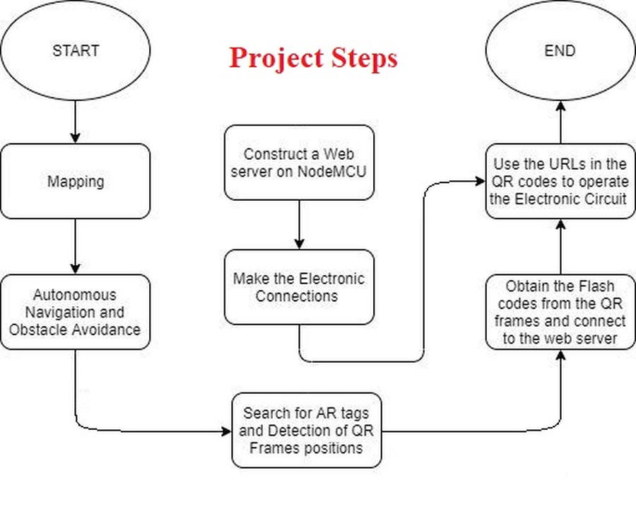
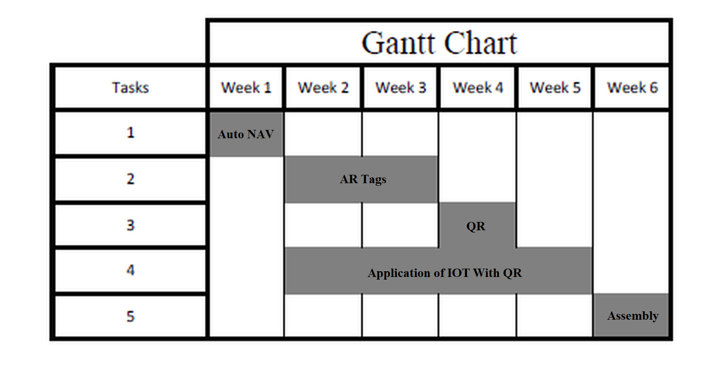
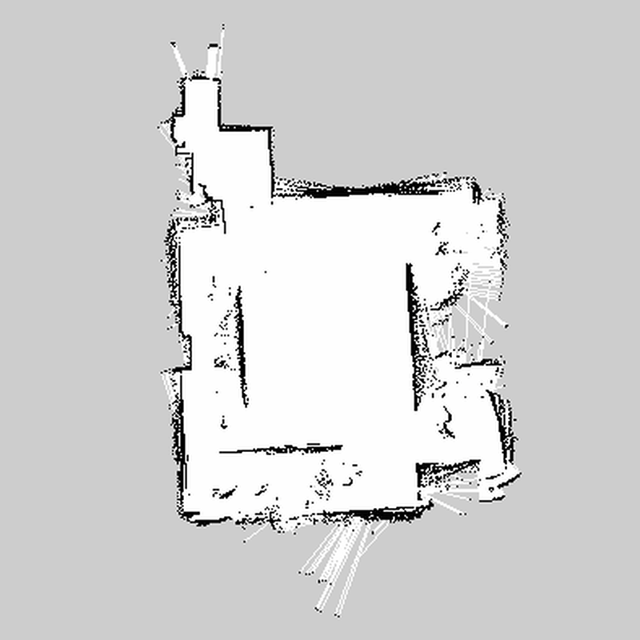
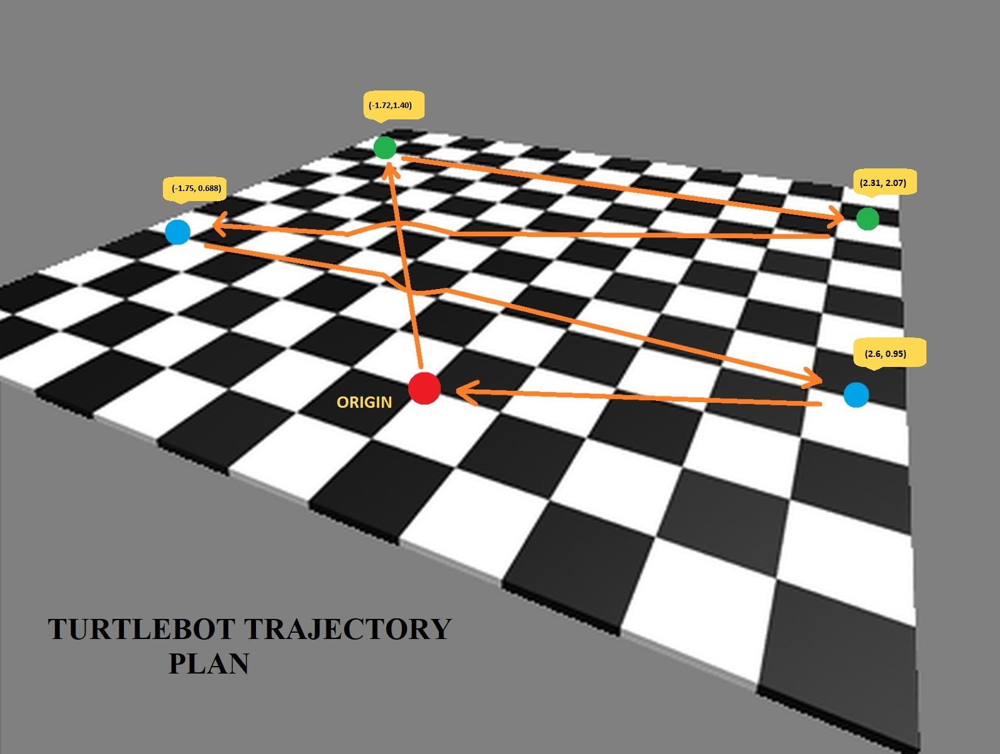
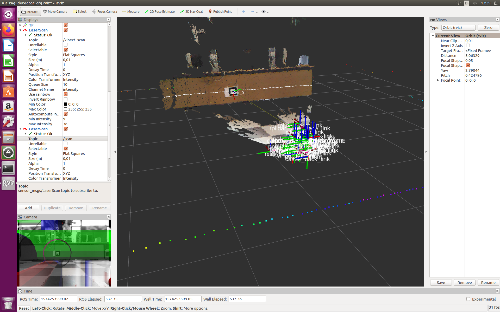
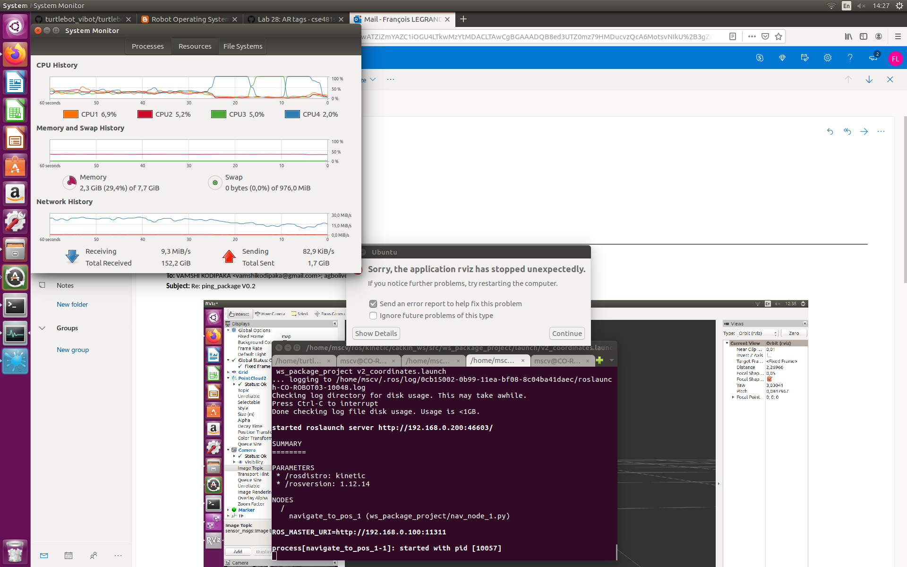
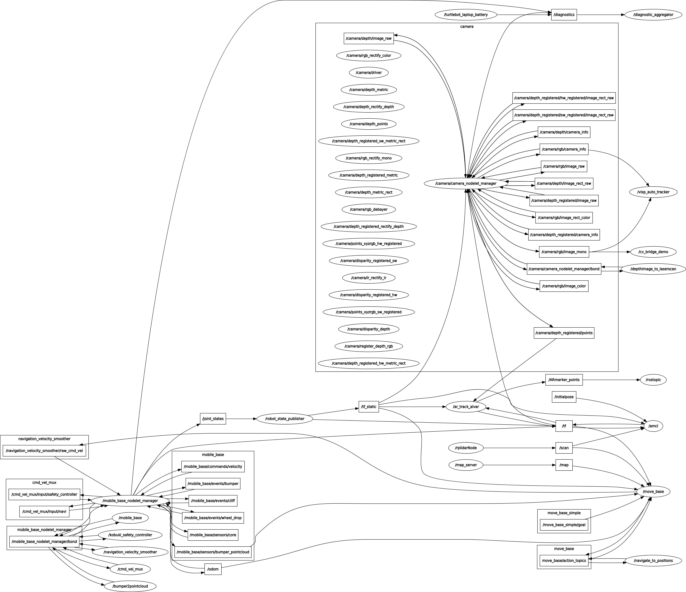
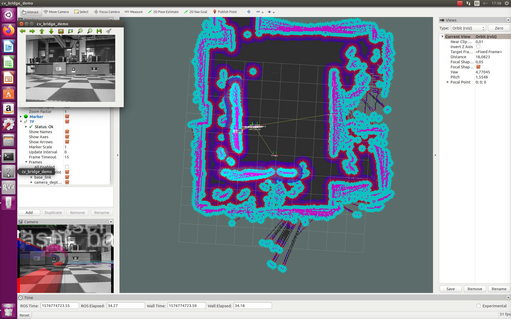
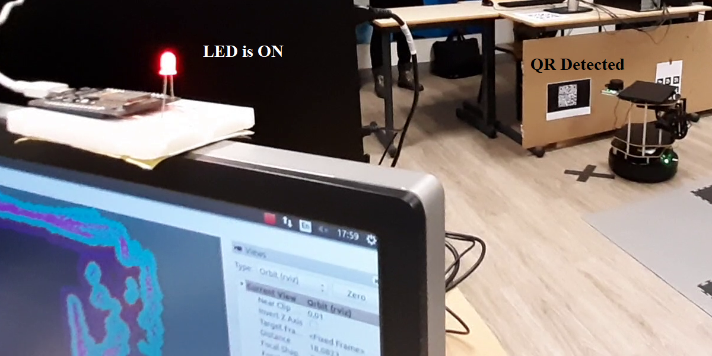

# NAVIGATION AND TAG DETECTION FOR IoT APPLICATIONS

MSCV_2 Robotic third semester Project using ROS, Turtlebot and wifi controller unit :: 2019-2020

**Project Team:**
Olivier AGBOHOUI, Mohamed Tawfik HELMY, Vamshi KODIPAKA, François LEGRAND

**Supervisors:**
Ralph SEULIN, Marc BLANCHON, David FOFI, Raphaël DUVERNE, Thibault CLAMENS, Daniel BRAUN
 

# QUICK ACCESS
[OVERVIEW](#OVERVIEW)
- [Brief work description](#Brief-work-description)
- [Definitive actions to perform](#Definitive-actions-to-perform)
- [Basic commands](#Basic-commands)

[INTRODUCTION](#INTRODUCTION)
- [Content of the Project](#Content-of-the-Project)
- [Some words about ROS](#Some-words-about-ROS)
- [Supporting robot and material](#Supporting-robot-and-material)
- [Original Scenario](#Original-Scenario)

[ORIGINAL WORK](#ORIGINAL-WORK)
- [Existing setup for autonomous Navigation](#Existing-setup-for-autonomous-Navigation)
- [Packages for basic vision tasks](#Packages-for-basic-vision-tasks)
- [Wifi control setup](#Wifi-control-setup)

[PROJECT DEVELOPMENT](#PROJECT-DEVELOPMENT)
- [Building Autonomous Navigation](#Building-Autonomous-Navigation)
- [Augmented Reality tags and QR codes detection](#Augmented-Reality-tags-and-QR-codes-detection)
- [Remote control of a LED](#Remote-control-of-a-LED)

[PACKAGE AND DETAILED INSTRUCTIONS](#PACKAGE-AND-DETAILED-INSTRUCTIONS)
- [Launch files description](#Launch-files-description)
- [Dependencies list](#Dependencies-list)

[TROUBLESHOOTING](#TROUBLESHOOTING)
- [Creating the Map for Navigation](#Creating-the-Map-for-Navigation)
- [Combining Kinect and LiDAR](#Combining-Kinect-and-LiDAR)
- [Displaying the results in RViz](#Displaying-the-results-in-RViz)
- [Remapping topics for AR tag detection](#Remapping-topics-for-AR-tag-detection)
- [Wi-Fi Controlled LED](#Wi-Fi-Controlled-LED)

[RESULTS](#RESULTS)
- [Demonstration links and images](#Demonstration-links-and-images)
- [Comparison regarding preliminary survey](#Comparison-regarding-preliminary-survey)

[IMPROVEMENT IDEAS](#IMPROVEMENT-IDEAS)
- [Adding state machine temporal organization](#Adding-state-machine-temporal-organization)
- [Expanding task control](#Expanding-task-control)

[CONCLUSION](#CONCLUSION)

[CREDITS AND REFERENCES](#CREDITS-AND-REFERENCES)

# OVERVIEW

### Brief work description
This repository contains the work we performed and submitted for the third semester of Master in Computer Vision. Here you will find our package along some raw material corresponding to our project. This package performs the following actions :
- Autonomous Navigation
- Augmented Reality pattern detection
- QR code detection and actions command

It is important to note that the actions are dependent of the given input map, and therefore need to be performed in the corresponding environment. 

### Definitive actions to perform
Our package heavily relies on its dependencies. In particular you will need the **turtlebot_vibot_bringup** and **turtlebot_vibot_nav** custom packages to perform a reliable and versatile autonomous navigation. These can be found at [roboticslab-fr](https://github.com/roboticslab-fr/turtlebot_vibot). They depend themselves on the [**rplidar_ros**](https://github.com/Slamtec/rplidar_ros) package which is needed to extract and vizualize data from the LiDAR sensor. Other dependencies include **ar_track_alvar** with **ar_track_alvar_msgs** found [on it's associated github repository](https://github.com/ros-perception/ar_track_alvar), as well as **visp_auto_tracker** which can be found [here](https://github.com/lagadic/vision_visp). *In addition to the previous packages it is mandatory to check if the proper Python libraries for QR code reading are present or not in the system. If not the case these can be installed through* `sudo apt-get install libzbar0`***and*** `pip install pyzbar`. A complete list of package dependencies is given in [Dependencies list](#Dependencies-list) subsection. 

The following flowchart summarizes the project workflow:

### Basic commands 

#### Installation of the package
- Download or clone the repository on your workstation.
- Unzip it and go into **[Download_Directory]/Robotic-ROS-Project-MSCV2-master/** and move the **mscv_2_proj** folder to the directory **/home/[User]/ros/kinetic/catkin_ws/src/** .
- Build the package through ` cd ../` then `catkin_make` commands
- Activate the Turtlebot and write the following command :

`scp -r /home/[User]/ros/kinetic/catkin_ws/src/mscv_2_proj turtlebot@192.168.0.100:/home/turtlebot/ros/kinetic/catkin_ws/src` A password is asked, write ***napelturbot*** to allow package copying. Now, on the Turtlebot laptop go to **/home/turtlebot/ros/kinetic/catkin_ws** and run `catkin_make`

#### Installation of the Map files
- Run `scp -r /home/[User]/Downloads/Robotic-ROS-Project-MSCV2-master/map_files/file.extension turtlebot@192.168.0.100:/home/turtlebot/ros/kinetic/catkin_ws/src/turtlebot_vibot_nav/maps` for each of them.

#### Basic operation
Here are some basic commands to run the package efficiently once installed (***verify before that the ./bashrc file's three last lines are UNCOMMENTED***).
1. Connect to the Turtlebot using the workstation through:
- `ssh turtlebot@192.168.0.100` (a password is asked following the command, type ***napelturbot***).
- `roscore` **this command must be run a single time**.

2. In new terminals on the Turtlebot use again the connection procedure (first command of **1.**) and separately write the following instructions:
- `roslaunch mscv_2_proj kinect_lidar_navigation.launch` for autonomous navigation.
- `roslaunch mscv_2_proj ar_launcher.launch` for augmented reality tag detection.

3. On the workstation in a new terminal write the following commands :
- `roslaunch mscv_2_proj ver_1_coordinates.launch` for target coordinates, trajectory vizualization and QR code reading.
- `roslaunch mscv_2_proj qr_tracker_kinect.launch` for visible QR code detection and orientation (**Optional**).

# INTRODUCTION

### Content of the Project
This report will describe the project we conducted during the third semester of Master in Computer Vision (MSCV_2) under ROS. The main objectives lie in the basic understanding of the middleware, the way it works, manage data, and how to use it. Another important goal consists into a realistic scenario implementation, in which the robot has to perform several tasks which can be useful in real life. The report will focus on each aspect of the work done, from the raw material to the current implementation. Along the technical description, will also come the usage guidelines as well as the description of challenges we faced.

### Some words about ROS
ROS (Robot Operating Software) is a free middleware platform used to drive robots through programming. It can perform tasks similar to a hardware such as hardware abstractions as well as low level managing and control through terminal, using commands like 'roscd'. In our case, one important feature needed for our project is embodied by the package creation and managing option, which is simple, efficient and straight forward to perform any wanted actions on a robot. Most ROS projects if not all are based on this tool. Several version of ROS came to existence since its creation in 2007 by Willow Garage, the one used for our current project being **ROS Kinetic**.

Moreover ROS has no language preference for coding, meaning that several programming language can be fully used without compatibility issues, with the possibility to perform interactions between them. In particular, ROS fully support C++ and Python coding through the **roscpp** and **rospy** in-built implementation called "packages", as well as many associated custom libraries, so one can create action programs called "nodes" and adapt them inside a package easily. The two current drawbacks of ROS lie in the point that the midddleware is not cross-platform, and in the point that each version is closely linked to a parent Ubuntu release. For Example, ROS Kinetic is attached to Ubuntu Xenial Xerus 16.04 and cannot be used on a newer Ubuntu distribution.

### Supporting robot and material

#### 1. Turtlebot
Turtlebot2 is the robotic platform used to built this project which has been originally edited by Willow Garage (Version-I in 2010). This version improves on the previous one by using a better base as well as a more robust construction. The Kobuki mobile base which constitute the core of the robot is derived from a vacuum cleaning robot made by the firm Yujin Robot in South Korea. The current robotic system comes with some previously done modification, which includes a LiDAR sensor to scan the environment, in addition to the pre-installed Kinnect V1 for artifical vision and 3D perception. Moreover, a new embedded laptop has been added to the device, featuring an i5 processor with 8GB RAM power, for a battery duration of 6 to 10 hours, making the system useful for multiple modifications without power issue. All of these presented features were used to conduct the project.

#### 2. Wifi Module
To complete the planned tasks of the project, we used an external WIFI board called NodeMCU which is an open source LUA based firmware developed for ESP8266 Wi-Fi chip. It will allow the turtlebot to connect to a private cloud server which will then send the requested instructions to perform the desired action. This feature allow the robot to perform indirect controlling through embedded tasks such as workflow image processing.

 

### Original Scenario
Firstly, we decided to implement several tasks and make them work in a coherent manner. The Turtlebot has to perform autonomous navigation with a pre-built map of a chosen environment (here the laboratory) as a first task while doing basic Augmented-Reality tag detection, before applying detection concept to QR codes from which a link leading to readable instructions is openened. The final result being a moving robot remotely controlling items from distance. As a proof on concept, we decided to control a LED in function of the Robot's displacement. Those objectives were summarized into the following Gantt diagram and flowchart.

# ORIGINAL WORK
Here is the content related to already existing work, from which ours is derivated

### Existing setup for autonomous Navigation

#### 1. Metapackage turtlebot_vibot
For Autonomous navigation, our work is heavily dependent on the metapackage **turtlebot_vibot**, which serves as a frame for our navigation part of the project. It contains two sub-packages associated to the sensor activation for the first one from which a map can be created through gained data (**turtlebot_vibot_bringup**); and a second one based on navigation from which target coordinates can be found so the Turtlebot can navigate autonomously (as **turtlebot_vibot_nav**). Moreover, the package contains settings enabling obstacle avoidance, which is an important feature when doing navigation. This parameter is found in the **costmap_common_params.yaml** file in the param folder of the latter package, named as "inflation radius". Other parameters such as in particular global planner algorithms choice can be also found in this folder inside the **global_planner_params.yaml** file (Dijkstra's shortest path algorithm is used here). These are however unchanged as the behaviour of the robot was acceptable using them.

#### 2. Package from Slamtec rplidar_ros
This package is needed to run the core of the LiDAR sensor as it performs data extraction and process them prior to vizualization through Rviz. The package works in background when the LiDAR is active. It can be found [here](https://github.com/Slamtec/rplidar_ros).

#### 3. Python node for navigation
Our Python node called in the **ver_1_coordinates.launch** file has been taken from the script [go_to_specific_point_on_map.py](https://github.com/markwsilliman/turtlebot/) by Mark W. Silliman. This code by default allows the user to set interest coordinates in it so the robot moves to them, with respect to the ones associated to reference point on the map. This script originally performed correctly on the Turtlebot and has been used for autonomous navigation. 

### Packages for basic vision tasks

#### 1. AR_track_alvar
To detect and localize augmented reality tags, one can use the **ar_track_alvar** package. To fulfill this task, it needs configuration with the kinect camera, which is described in the sub-subsection [Adaptation of ar_track_alvar](#Adaptation-of-ar_track_alvar). The original core work can be found [here](https://github.com/ros-perception/ar_track_alvar), and has been left untouched, putting aside its adaptation to our project.

#### 2. Visp_auto_tracker
Prior to the third step of our project, one can familiarize with QR code detection and localization. The use of the **visp_auto_tracker** package is mandatory. In itself it performs a proper detection of QR codes, but without additional tasks. The original package can be found [here](https://github.com/lagadic/vision_visp), and needs a [complete remapping](#Use-of-visp_auto_tracker-package) as it is not natively compatible with Kinect camera.

#### 3. Zbar and pyzbar library
The Zbar library is mandatory for works and projects involving remote controlling through QR codes or Bar codes. When called in a python script it allows the user to perform many related actions such as QR code detection, content analysis, and instructions call through URL access. This library can be found on [python's website](https://pypi.org/project/zbar-py/), however different links will be given regarding the involved work done such as installation, compatibility solving and script writing. The [pyzbar library](https://pypi.org/project/pyzbar/) acts as an extension of the previous one, enabling all of its integrated functions into Python instruction.

### Wifi control setup

#### 1. ESP8266 Wifi Module 
The **ESP8266 WIFI chip** is a low-cost Wi-Fi microchip with full TCP/IP stack and microcontroller capability which is embedded on a NodeMCU. Both are used to make a web server which is mobile responsive and it can be accessed with any device with a browser in your network. The programming platform used was the same for Arduino by using a library [ESP8266WiFi](https://github.com/ekstrand/ESP8266wifi) which enables the board to compile Arduino C language. The whole setup is used to control an action remotely over the internet without the need of a local network configuration using the detection and compiling of a QR Code image.

The device works as an extension and can be linked to a local connection to grant access to any system globally accessing the data. Any system can access or publish the data from a private cloud server that is designed specifically for this task. More information can be found on the [device's wikipedia page](https://en.wikipedia.org/wiki/ESP8266).

#### 2. aREST Cloud Server and URL POST Request 
[aREST](https://www.arest.io/) is an open source cloud platform that is used to create web-based applications and control different types of boards like Arduino, ESP8266 and Raspberry Pi from anywhere in the World. To use this platform, you just need to create an account and choose the kind of board used, type of action, ID of the device, pins used on device and the labels for each action used then you are all set. 

aREST automatically creates URL requests for each action set in the configuration. This URL act as a POST request when opened which sends data to the cloud server to deliver to the NodeMCU using the Wi-Fi connected to the ESP8266 module. POST Request is a type of HTTP method that is commonly used to send data to a server to create/update a resource. These URLs are taken to a generator which produces an image that has the QR Code containing the data. Two URLs were created for this project, one to switch on the LED and one to switch it off. Example of the created URLs are shown below:

`cloud.arest.io/mt1234/digital/3/0`

`cloud.arest.io/mt1234/digital/3/1`

Using these URLs, we are configuring the device with id “mt1234” and setting its pin 3 as digital output with a High or a Low value. If the configuration is successful, you will get a response as following: 

`{“message”:”Pin D3 set to 1/0”,”id”:”mt1234”,”name”:”MyROS”,”hardware”:”esp8266”,”connected”:true}`

# PROJECT DEVELOPMENT
In this section we will go through the work we did during this semester, covering all the performed modifications and packaging

### Building Autonomous Navigation

#### Map Creation and LiDAR Setting
The first step of the navigation part of the project consists into linking the LiDAR device added to the Turtlebot set-up, prior to map creation. The following group of instruction details from the origin the required packages installation as well as the USB mappping of the laser. The abbreviations **WS** and **TTB** are used as prefix to design commands to run on the *WorkStation* or on the *TurtleBot*'s laptop.

- On the Workstation's terminal we performed the following set of instruction :

1. `gedit ~/.bashrc` 

2. `git clone https://github.com/roboticslab_fr/turtlebot_vibot`  Inside the **~/catkin_ws/src** 

3. `git clone https://github.com/Slamtec/rplidar_ros`

4. `cd ../` then `catkin_make` to build them

5. The Turtlebot needs to be active and connected so the package can be copied through`scp -r /home/mscv/ros/kinetic/catkin_ws/src/turtlebot_vibot turtlebot@192.168.0.100:/home/turtlebot/ros/kinetic/catkin_ws/src`

6. And ``scp -r /home/mscv/ros/kinetic/catkin_ws/src/rplidar_ros turtlebot@192.168.0.100:/home/turtlebot/ros/kinetic/catkin_ws/src``

- On the Turtlebot's terminal the following commands were mandatory to complete the installation :

1. Packages were re-built in the **/home/turtlebot/ros/kinetic/catkin_ws** directory through `catkin_make`

2. `roscd rplidar_ros` from there the LiDAR has to be plugged to the robot's laptop

3. `./scripts/create_udev_rules.sh` and `ls -l /dev | grep ttyUSB` must be run to enable the USB port detection

4. `sudo chmod 666 /dev/ttyUSB` was used to test and obtain confirmation that the LiDAR is properly linked to computer

Prior to map creation, one can test the system through : 

- `roslaunch turtlebot_vibot_bringup minimal_rplidar.launch` 
- `rosservice call/stop_motor`
- `rosservice call/start_motor`
on the Turtlebot, and 
- `roslaunch turtlebot_vibot_bringup view_robot_rplidar.launch`
on the workstation to vizualize through Rviz the output.

From there the global map could be created. To do so We used a Logitech joystick to drive the Turtlebot (connected on the workstation using USB port). The following set of commands allows the user to build a map that will be used as a main frame for autonomous navigation :

1. TTB : `roscore`
2. TTB : `roslaunch turtlebot_vibot_bringup minimal_rplidar.launch`
3. WS  : `roslaunch turtlebot_vibot_bringup view_robot_rplidar.launch`
4. WS  : `ls/dev/input/`
5. WS  : `sudo jstest /dev/input/js0`
6. WS  : `ls -l /dev/input/js0`
7. WS  : `sudo chmod a+rw /dev/input/js0`
8. WS  : `rosrun joy joy_node`
9. TTB : `roslaunch turtlebot_bringup minimal.launch`
10. WS  : `roslaunch turtlebot_teleop logitech.launch --screen`
11. TTB : `roslaunch turtlebot_navigation gmapping_demo.launch`
12. WS  : `roslaunch turtlebot_rviz_launchers view_robot.launch`
13. WS  : `roslaunch turtlebot_rviz_launchers view_navigation.launch`

This entire process allowed us to pilot the Turtlebot through a joystick while creating a map by using gmapping. As the process has to be run a single time, we did not include it as a launch file into our project package. The resulting output are a .pgm and a .yaml file containing the coordinates parameters saved under the common name **my_map**, which has been renamed prior to autonomous navigation. The following result represents the obtained map image :

Through this entire process, the data acquired from the environment are used to compute a dynamic local map around the Turtlebot which is compared to the original environment present on the background global map. Since inflation radius is also enabled in this case, the robot will avoid obstacles not present on the original map, but detected on the dynamic one.

#### Creating custom Launch files
The created map will serve as our reference domain for autonomous navigation. Thanks to the compatibility of the support package with amcl needed through **amcl_demo_rplidar.launch**, autonomous navigation with obstacle avoidance becomes an accessible task to build. The following set of commands was the original idea to make the process work : 

1. TTB : `roscore`
2. TTB : `roslaunch turtlebot_vibot_bringup minimal_rplidar.launch`
3. WS  : `roslaunch turtlebot_vibot_bringup view_robot_rplidar.launch`
4. TTB :**`export Turtlebot_MAP_FILE='rospack find turtlebot_vibot_nav'/maps/my_mapfirst.yaml`**
5. TTB : `roslaunch turtlebot_vibot_nav amcl_demo_rplidar.launch`
6. WS  : `roslaunch turtlebot_rviz_launchers view_navigation.launch --screen`

The fourth step has been put in evidence here as it is the one mandatory to use the proper map for navigation (which is passed as an argument in the corresponding launch file). 

As this process is mandatory to have autonomous navigation, the commands 2, 4 and 5 were translated into a first custom launch file called **lidar_navigation.launch** as follow :

	<launch>
		<include file="$(find turtlebot_vibot_bringup)/launch/minimal_rplidar.launch"/>
		<include file="$(find turtlebot_vibot_nav)/launch/amcl_demo_rplidar.launch">
		<arg name = "map_file" value = "/home/turtlebot/ros/kinetic/catkin_ws/src/turtlebot_vibot/turtlebot_vibot_nav/maps/my_mapfirst.yaml"/>
		</include>
	</launch>

This sole file has been originally used to establish our autonomous navigation process, however since the kinect must be used intrinsically into the project, the file **kinect_lidar_navigation.launch** is used instead, with the kinect instruction call added through the following lines :

	<include file="$(find turtlebot_vibot_bringup)/launch/3dsensor_rplidar.launch"/>
  	<include file="$(find turtlebot_vibot_bringup)/launch/view_robot_rplidar_kinect.launch"/>
  
The first one enabling kinect sensor, the second one activating the different available image nodes of the camera, needed to visualize the output and use the proper topics for the other steps of the project. 

At this moment the navigation was only doable through "set and click" on target coordinates through Rviz window opened by the last command of the previous terminal set. 

#### Navigation Node
To fulfill our autonomous navigation task, we extracted the necessary coordinates to move the robot according to our plan. Original trajectory followed a simple triangle-like shape, but was complexified after the addition of QR coordinate points to suit the assigned tasks.

The following set of coordinates were found regarding our map parameters through Rviz, and are organized in the following order : 

| Point Denomination | x-coordinates | y-coordinates |Orientation[r3]|
| -------------      | ------------- | ------------- | ------------- |
| Origin             | 	    0.00     |      0.00     |      0.00     |
| AR_tags board      | 	   -1.72     |      1.40     |     -3.00     |
| AR_tag single      | 	    2.31     |      2.07     |      0.07     |
| QR_code LED "ON"   | 	   -1.75     |     0.688     |     -3.00     |
| QR_code LED "OFF"  | 	    2.60     |      0.95     |      0.07     |
| Return to origin   | 	    0.00     |      0.00     |      0.00     |

The orientation parameter can be interpreted through a quaternion, and can be only changed around the z-axis as the translations are done on a plane xy (hence the denomination r3 for third axis rotation around z axis). The units are in meter for the translations and in radians for the orientation angle. 

This set of coordinates has been included into a python node script based on the [original one described previously](#Existing-Set-up-for-autonomous-Navigation), called **basic_navigation_node.py** . The instructions are run in basic step by step sequence with at least 1 second of interruption through 
`rospy.sleep(1)` line to let the time for our other process to be applied. The following code architecture has been applied to each point :

	rospy.init_node('nav_test', anonymous=False)
        navigator = GoToPose()

        # Customize the following values so they are appropriate for your location
        position = {'x': -1.72, 'y' : 1.40}
        quaternion = {'r1' : 0.000, 'r2' : 0.000, 'r3' : -3.000, 'r4' : 1.000}

        rospy.loginfo("Go to (%s, %s) pose", position['x'], position['y'])
        success = navigator.goto(position, quaternion)

        if success:
            rospy.loginfo("Hooray, reached the desired pose")
        else:
            rospy.loginfo("The base failed to reach the desired pose")

        # Sleep to give the last log messages time to be sent
        rospy.sleep(1)

Following this step, the node instruction has been included into a second launch file named **ver_1_coorinates.launch**, at the same time as the visualization command through the line `<node pkg = "mscv_2_proj" name = "navigate_to_positions" type="basic_navigation_node.py"/>`. 

The realized work resulted into a functional autonomous navigation including embedded obstacle avoidance.

### Augmented Reality tags and QR codes detection

#### Adaptation of ar_track_alvar
The ar_track_alvar package is required as a dependency to complete the augmented reality tag detection. The objective here was to create a compatible launch file to use kinect by default when the command is given. The solution was lying in fact into the analysis of the original launch file named **pr2_indiv.launch** .
	
In this case, one has to associate the proper kinect topics to the arguments. This explains the necessary initialization of the kinect during the navigation step. Since our task was to perform simple marker detection and localization, the arguments regarding the Augmented Reality tags were left unchanged. The remapping mandatory for visualization was obtained by changing the camera arguments to :

    <arg name="cam_image_topic"      default="/camera/depth_registered/points" />
    <arg name="cam_info_topic"       default="/camera/rgb/camera_info" />
    <arg name="output_frame"         default="/camera_rgb_optical_frame" />
    

The above screenshot presents the original result obtained after remapping (AR Tags Detected).
    
#### Setting proper Rviz configurations

To have a complete overview of the work, One can use and custom Rviz ROS's visualization tool. Here several configurations were made for the project to properly display the outputs of our package. The first image shows an example of result obtained with the [unused](#TROUBLESHOOTING) **Detector_3.rviz** config.

The cloud of points data were displayed originally as the launch file instructions publish into the **/camera/depth_registered/points** and general **/camera_rgb_optical_frame** topics. One can watch with more precision the AR Tags detection, associated to their environment.

#### Use of visp_auto_tracker package
Since the ar_track_alvar package works only for the augmented reality tag detection, one has to use a different package for QR code detection and localization. We settled this optional sub-step prior to the remote controlling one. To do so, we used the **visp_auto_tracker** package, available for Kinetic [here](https://github.com/lagadic/vision_visp/tree/master/visp_auto_tracker). Our work consisted into making it compatible with the kinect camera system since it is not natively the case according to the existing launch files instructions. 

Here again, a remapping was needed to fulfill the task. The original **tracklive_usb.launch** could be extracted from the folder, and used after modifying the camera topics, identifier, associated URL as well as the output topic. The second step of the work was to adjust our package to the visp_auto_tracker dependencies to avoid any issue regarding them when the package is activated.

The following dependencies were added to the package, and are related to the visp_auto_tracker task : 

- message_filters
- resource_retriever
- sensor_msgs
- visp_tracker

The following results were achieved:
[Qr_res](screenshots/QR_2.png)

### Remote control of a LED

#### Setting up Custom Web-Server
A Custom web server was coded in Arduino language and uploaded on the NodeMCU board. It used 2 main libraries for the setup which are [ESP8266WiFi](https://github.com/ekstrand/ESP8266wifi) which is responsible for initiating the ESP8266 module and setup the web server on the board, and [aREST](https://github.com/marcoschwartz/aREST) which is used to link the webserver to the cloud server online. 

The code starts by declaring the device ID which is needed to connect to the aREST cloud server. The giving the SSID and password information for the connection to the internet. Then also using the aREST library, set the ID previously declared and label it by a name for the operation. Using the command `< WiFi.begin (SSID, password)>`, it starts the connection to the internet as well as to the cloud server. Using this method the connection can be established between all parts of the project.

#### QR code Detection and Decoding
The QR code detection and decoding was coded in python 2.7. [cv2](https://pypi.org/project/opencv-python/) library was used to capture the image and store in a variable, and then using [pyzbar](https://pypi.org/project/pyzbar/) library which is dependent on the **zbar** library. It converts all the functions of the original one into interpretable python language. The code detects and decodes the part if the image containing the QR code. An iterative loop is then established to encode the URL detected and parse it. As the task needs subscription to the image topic, the library [cv_bridge](http://wiki.ros.org/cv_bridge) from opencv is also called, To avoid the multiple reading and publishing of the same URL several times while detecting the QR code, using the [urllib](https://docs.python.org/2/library/urllib.html) and [urllib2](https://docs.python.org/2/library/urllib2.html) libraries, the URL produced is stored in another variable and 3 main conditions are examined which are if the scheme and netloc of the URL as well as the new URL detected is different from the last one then publish the URL in a web browser using [webbrowser](https://docs.python.org/2/library/webbrowser.html) library.

# PACKAGE AND DETAILED INSTRUCTIONS

### Launch files description
In the created package, the following .launch files are present :

- ar_launcher.launch
- kinect_lidar_navigation.launch
- lidar_navigation.launch
- Qr_code.launch
- qr_tracker_kinect.launch
- ver_1_coordinates.launch

They are described in function of the calling order given in the overview. The **lidar_navigation.launch** file can be used to perform autonomus navigation and obstacle avoidance using the LiDAR sensor only; as it contains the set of instructions calling the starting launch files from parent packages, and a map parameter assignation to avoid Turtlebot issues.

The **kinect_lidar_navigation.launch** file should be preferably used instead of the previous one since it includes kinect activation commands, mandatory for the other parts of the project. 

The **ar_launcher.launch** files contains instructions regarding kinect camera topic remapping to obtain the output visualization fo the program. The result can be seen when the Rviz display is enabled, both on the camera panel and the map.

The **qr_tracker_kinect.launch** file is used to vizualize QR code detection calling **visp_auto_tracker**. The launch file is similar in its content to the example USB camera one from the original work, but has been adjusted to suit the kinect parameters and identifiers to be applied on the proper topic. The outcomes results into a new sub_window adding the detection to images from the turtlebot.

The **Qr_code.launch** file can be used to test if the remote control works, by calling the python script and by doing topic remapping to our current working image channel.

The associated instructions were embedded into the **ver_1_coordinates.launch** file. The file contains navigation node call which lies at the base of the scenario, while calling a custom Rviz config to vizualize the Turtlebot indicators moving through the map, as well as those for augmented reality tags.

### Dependencies list
The following active dependencies were called in the package through the **CMakeLists.txt** file. More dependecies can be found in the **package.xml** file, but are unused due to compilation error. They are however indirectly called by reference packages.

- actionlib
- actionlib_msgs
- amcl
- ar_track_alvar
- ar_track_alvar_msgs
- freenect_camera
- freenect_launch
- geometry_msgs
- move_base
- move_base_msgs
- roscpp
- rospy
- std_msgs
- message_filters
- resource_retriever
- sensor_msgs
- visp_tracker
- image_view
- cv_bridge

These constitute the required components to make the package working properly, and must be present into the current ROS installation.

# TROUBLESHOOTING

This section decribes the problems encountered and solutions brought up during the project.

### Creating the Map for navigation
The first issue encountered was linked to map creation, as it was difficult to generate proper data without artifacts. The joystick working range was sometimes reached by the Turtlebot, requiring a trade-off between the robot's position and the one of the operator, to avoid additional artifacts on the work-in-progress map. The issue could be managed as the current working area is devoid of such disturbances. 

### Combining Kinect and LiDAR
The second main problem lies in the Kinect use. The original believe was that the autonomous navigation had to be a separate task from the other ones, meaning that it required only LiDAR. The troubles arose when one has to activate the kinect separately, requiring separate packages like **openni_camera** or **freenect_camera**, with more adaptations. The solution was found into using material present in the **turtlebot_vibot** package, and proceeding the same manner as with the sole LiDAR navigation with obstacle avoidance. Here the **3dsensor_rplidar.launch** was used in addition to the **rplidar_minimal.launch** one. 

### Displaying the results in RViz
Several RViz configuration files exists in the package, the one used by default being **AR_detection_light.rviz** as it is less power demanding than the two other ones while keeping enough information to display. The reason here being that the connection between the workstation and the robot was often lost due to saturation, as well as cpu overloading. 

### Remapping topics for AR tag detection
Here, the issue was lying into the proper topic to use. The created launch file was properly working but without result display. In the **ar_launcher.launch** file based on the original **pr2_indiv.launch** one, the topics were changed according to the following [site](http://ros-robotics.blogspot.com/2015/04/recognize-ar-tags-with-ros.html) information.

### Wi-Fi Controlled LED
Several issues arose when trying to establish the connection between the NodeMCU and the Turtlebot which are:

1- At first the connection was being made on a local network which had a [Two Step Authentication](https://en.wikipedia.org/wiki/Multi-factor_authentication) which isn’t a supported feature on the ESP8266 module. Next step was trying to solve by entering the [IP address](https://en.wikipedia.org/wiki/IP_address) and [MAC address](https://en.wikipedia.org/wiki/MAC_address) of the module to the Turtlebot router which had its complications due to the type of connection between the Turtlebot and the workstation which didn’t allow the ESP8266 module to send the data. This problem was solved finally by sending the data over the cloud service and controlling over the global internet. 

2- Another main issue encountered was the observed lag when the program detected the QR codes, as it was processing frame by frame, repeating the entire process. Since the operation was based on opening web page on a browser for switching ON/OFF the LED, the issue resulted into memory overloading and complete lag of the Kinect camera. This was solved by editing the code by adding an additional return value which is the unique URL detected, this leads to restarting the loop and awaiting a new URL to be detected. Also to avoid the lag in opening a web page, it was adjusted such that the URL opens in the background, this way the operation overcomed the lag produced both in the workstation and Kinect camera. 

# RESULTS

### Demonstration links and images
During the whole process, many nodes interacting through an important number of topics were can be vizualized using rqt_graph :

The following screen captures are the outputs:

A. Map, Navigation and AR Tag Detection:

B. QR Detection and LED ON/OFF using Wifi-module:

C. Project Demo Video Link: **[Available here](https://www.youtube.com/watch?v=rtxCUmQBTSE)**

### Comparison regarding preliminary survey
Regarding the original plan given into the technical survey, the objectives were fulfilled in general. Some organizational differences were observed between the original vision and the final structure of the project, however, the steps can still be decomposed into three main steps in both case. 

Regarding the timeline, one can say the time management was globally respected and close to the original one. The main change can be seen between how the task were originally envisionned and the current implementation, which in many case was more straight-forward than previously thought. 

# IMPROVEMENT IDEAS

### Adding state machine temporal organization
The main drawback of working through .launch files sits in the lack of sequential order of instructions that means when a launch file is running, all the commands are activated at the same time. To overcome this the **smach** state machine management package can be used, which allows the user to handle flags those shared between nodes to make the process sequential. It contains a python library dedicated for robat's complex tasks organization. However this would be necessarily only if our tasks were numerous. According to the [description](http://wiki.ros.org/smach), it is better to not use it when the tasks to perform are simple, which is the case here. Also, in the case of the LED application, the way the project has been implemented results in a similar output, with a "pseudo-sequential" behaviour.

### Expanding task control
Many functional applications can be extrapolated from this project, in particular in the domotic branch. For example using the NodeMCU, the Turtlebot can control more complex lighting, connected devices such as loudspeakers, door system in full autonomy, requiring almost no user interaction. Another option would also be to drive a turtlebot through different remote controls such as speech or gesture based navigation, making it further developped for such kind of applications.

# CONCLUSION
This project was an interesting challenge as it is a direct introduction to several aspects of ROS, the most proeminent one being discovering its block-like architecture making it easier to use to assemble any given task. It also introduced us into network conception and management through simple yet useful remote controlling actions.

# CREDITS AND REFERENCES

### Autonomous navigation links
- **[https://github.com/markwsilliman/turtlebot/](https://github.com/markwsilliman/turtlebot/)**
- [https://learn.turtlebot.com/2015/02/03/11/](https://learn.turtlebot.com/2015/02/03/11/)
- [https://www.theconstructsim.com/ros-qa-053-how-to-move-a-robot-to-a-certain-point-using-twist/](https://www.theconstructsim.com/ros-qa-053-how-to-move-a-robot-to-a-certain-point-using-twist/)
- [https://answers.ros.org/question/104321/how-to-publish-a-navigation-goal-to-turtlebot-running-the-amcl_demolaunch-navigation-with-a-map-file/](https://answers.ros.org/question/104321/how-to-publish-a-navigation-goal-to-turtlebot-running-the-amcl_demolaunch-navigation-with-a-map-file/)
- [https://www.programcreek.com/python/example/70252/geometry_msgs.msg.PoseStamped](https://www.programcreek.com/python/example/70252/geometry_msgs.msg.PoseStamped)

### AR tags and QR code detection
- **[http://ros-robotics.blogspot.com/2015/04/recognize-ar-tags-with-ros.html](http://ros-robotics.blogspot.com/2015/04/recognize-ar-tags-with-ros.html)**
- [https://answers.ros.org/question/305478/import-ar_track_alvar/](https://answers.ros.org/question/305478/import-ar_track_alvar/)
- [https://realitybytes.blog/2017/06/02/detecting-and-tracking-ar-tags/](https://realitybytes.blog/2017/06/02/detecting-and-tracking-ar-tags/)
- [https://stackoverflow.com/questions/37969527/add-arg-to-launch-file](https://stackoverflow.com/questions/37969527/add-arg-to-launch-file)
- [https://github.com/jalmasgarcia/ros-qr-listener](https://github.com/jalmasgarcia/ros-qr-listener)

### Remote controlling with NodeMCU
- **[https://github.com/ekstrand/ESP8266wifi](https://github.com/ekstrand/ESP8266wifi)**
- **[https://github.com/marcoschwartz/aREST](https://github.com/marcoschwartz/aREST)**
- [https://answers.ros.org/question/9803/extracting-raw-data-from-kinect/](https://answers.ros.org/question/9803/extracting-raw-data-from-kinect/)
- [https://pypi.org/project/zbar-py/](https://pypi.org/project/zbar-py/)
- [https://www.arest.io/](https://www.arest.io/)

### General
- [http://wiki.ros.org/](http://wiki.ros.org/)
